# Churn in telecom

With the rapid development of telecommunication industry, the service providers are inclined more towards expansion of the subscriber base. To meet the need of surviving in the competitive environment, the retention of existing customers has become a huge challenge. In the survey done in the Telecom industry, it is stated that the cost of acquiring a new customer is far more that retaining the existing one. Therefore, by collecting knowledge from the telecom industries can help in predicting the association of the customers as whether or not they will leave the company. The required action needs to be undertaken by the telecom industries in order to initiate the acquisition of their associated customers for making their market value stagnant.The goal of this article is to apply analytical techniques, using Elastic Stack, to predict a customer churn and analyse the churning and non churning customers.
This article has been inspired from [Elastic Blog](https://www.elastic.co/blog/using-elastic-supervised-machine-learning-for-binary-classification)


# Why supervised learning ? 

Supervised machine learning trains a model from labeled data (means a dataset with a list of customers with a label to show if the customer has churned or not). This is in contrast to unsupervised learning where the model learns from unlabeled data. In [data frame analytics](https://www.elastic.co/guide/en/machine-learning/master/ml-dfa-overview.html), Elastic Stack give you the toolset to create supervised models without knowledge of the underlying algorithms. You can then use the trained models to make predictions on unobserved data (via inference). The model applies what it learned through training to provide a prediction.

Why use this instead of [anomaly detection](https://www.elastic.co/guide/en/machine-learning/master/xpack-ml.html) ? Anomaly detection, an example of unsupervised learning, is excellent at learning patterns and predicting metrics based on time series data. This is powerful for many use cases, but what if we wanted to identify bad actors by detecting suspicious domains ? What about automatically detecting language and applying the appropriate analyzers for better search ? 

These use cases need richer feature sets to provide accurate predictions. They also have known examples from which to learn. Meaning, there exists a training dataset where the data is labeled with the correct prediction. Transforms supplies the tools needed to build complex feature sets. Data frame analytics can train supervised machine learning models. We can use both to deploy the feature generation and supervised models for production use on streaming data.

# Supervised learning example : binary classification

Let’s build and use a binary classification model from scratch. Don’t be intimidated. No data science degree is necessary. We will use the building blocks within the Elastic Stack to create our feature set, train our model, and deploy it in an ingest pipeline to perform inference. Using an ingest processor allows our data to be enriched with the model’s predictions before being indexed.

In this example, we will predict whether a telecom customer is likely to churn based on features of their customer metadata and call logs. We’ll use examples of churned and not churned customers as the training dataset. 

# Setting up your environment

To follow along, start a free trial of [Elastic Cloud](https://www.elastic.co/elasticsearch/service), spin up a [new deployment](https://www.elastic.co/guide/en/cloud/current/ec-create-deployment.html) or simply download Elasticsearch, Kibana and Logstash from [Elastic](https://www.elastic.co) web site, download the [calls.csv](./call.7z) and [customers.csv](./customers.7z) files, and upload them via the [CSV upload feature](https://www.elastic.co/blog/importing-csv-and-log-data-into-elasticsearch-with-file-data-visualizer) (or use Logstash). Data is derived from a dataset referenced in various sources : [openml](https://www.openml.org/d/40701), [kaggle](https://www.kaggle.com/becksddf/churn-in-telecoms-dataset), [Larose 2014](http://dataminingconsultant.com/DKD2e_data_sets.zip). This dataset was disaggregated into line items, and random features were added. Phone numbers and other data are fabricated and any resemblance to real data is coincidental. 

Once uploaded you should have data that looks like this :

In the customers index :

```json
{
  "record_id": 332,
  "@timestamp": "2020-09-08T10:16:15.019Z",
  "phone_number": "2253803437",
  "account_age": 86,
  "number_vmail_messages": 0,
  "customer_service_calls": 7,
  "voice_mail_plan": "no",
  "state": "AB",
  "international_plan": "no",
  "churn": 1,
}
```
In the calls index :

```json
{
  "record_id": 1,
  "@timestamp": "2020-07-07T07:21:40.102Z",
  "phone_number": "2253803437",
  "dialled_number": "2253283266",
  "call_charges": 0.34497474848639376,
  "call_duration": 3.3484235812459193
}
```

# Building the feature set

First, we want to build out our feature set. We have two sources of data: customer metadata and call logs. This requires the use of transforms and the enrich processor. This combination allows us to merge the metadata along with the call information in the other index.

The enrichment policy and pipeline. (Execute the commands in the Kibana dev console)

````json
# Enrichment policy for customer metadata
PUT /_enrich/policy/customer_metadata
{
  "match": {
    "indices": "customers",
    "match_field": "phone_number",
    "enrich_fields": [
      "account_age",
      "churn",
      "customer_service_calls",
      "international_plan",
      "number_vmail_messages",
      "state",
      "voice_mail_plan"
    ]
  }
}
````
````json
# Execute the policy so we can populate with the metadata
POST /_enrich/policy/customer_metadata/_execute
````

```json
# Our enrichment pipeline for generating features
PUT _ingest/pipeline/customer_metadata
{
  "description": "Adds metadata about customers by lookup on phone_number",
  "processors": [
    {
      "enrich": {
        "policy_name": "customer_metadata",
        "field": "phone_number",
        "target_field": "customer",
        "max_matches": 1
      }
    }
  ]
}
```

We can now build a transform that utilizes our new pipeline. Here is the transform definition:

```json
# transform for enriching the data for training
PUT _transform/customer_churn_transform
{
  "source": {
    "index": [
      "calls"
    ]
  },
  "dest": {
    "index": "churn_transform_index",
    "pipeline": "customer_metadata"
  },
  "pivot": {
    "group_by": {
      "phone_number": {
        "terms": {
          "field": "phone_number"
        }
      }
    },
    "aggregations": {
      "call_charges": {
        "sum": {
          "field": "call_charges"
        }
      },
      "call_duration": {
        "sum": {
          "field": "call_duration"
        }
      },
      "call_count": {
        "value_count": {
          "field": "dialled_number"
        }
      }
    }
  }
}
```

Now that the transform is created, we can start it and see its progress on the Transforms page under Stack Management.


Once tranform executed you should have data that looks like this :

In the customers churn_transform_index :

```json
{
  "phone_number": "2253271058",
  "call_count": 253,
  "call_charges": 45.72,
  "call_duration": 488.5,
  "customer": {
    "voice_mail_plan": "no",
    "number_vmail_messages": 0,
    "churn": 0,
    "account_age": 112,
    "phone_number": "2253271058",
    "state": "AB",
    "international_plan": "no",
    "customer_service_calls": 0
  }
}
```

We have built sums of call charges, number of calls, and call durations. These features paired with our customer metadata should be enough to build a churn prediction model.

We have a total of nine features in our feature set, three of which are categorical features. Additionally, we have the field `customer.churn`. This represents historical data of customers that have churned in the past. It will be the label our supervised learning utilizes to build our predictive model.

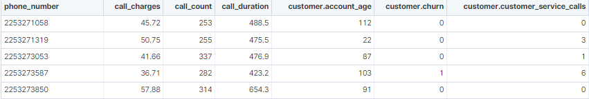
<p>
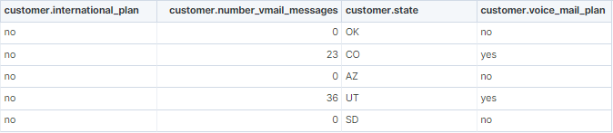


# Building the model

Once we have our feature set, we can start building our supervised model. We will predict churn based on our customer calling data. 

Note: An index pattern referencing the newly pivoted data is required. The pattern I chose was `churn_transform_index`.

Navigate to the Data Frame Analytics tab in the Machine Learning app in Kibana.

To create the job let’s first:

- Select the `classification` job type for predicting the two classes of `churn`
- The dependent variable is `customer.churn` as that is what we are trying to predict


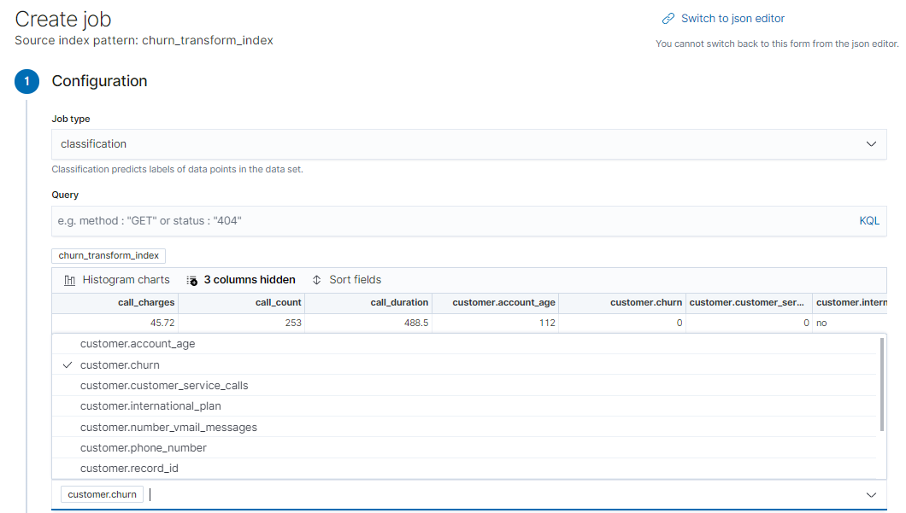

- We should exclude fields we know don’t add information. In this case, `customer.phone_number` and `phone_number` are unique per entry and don’t contain useful information.

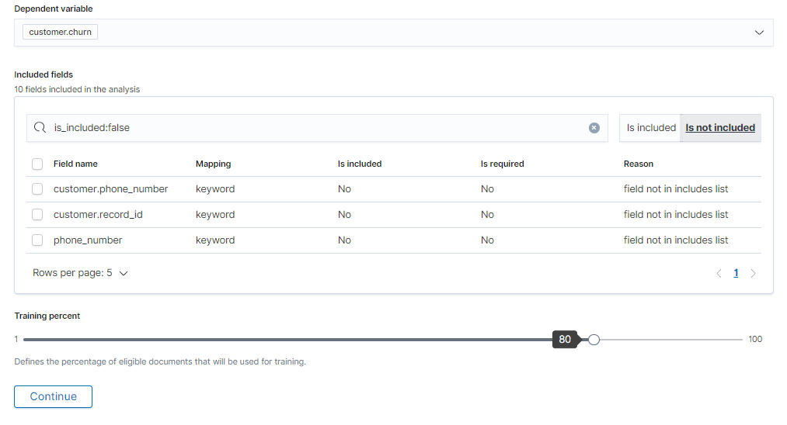

- It's fine to keep the default training percent of 80
- Click on continue
- Keep the model memory limit as it is. This allows the job executor to execute on a node that can support at least this amount of memory.


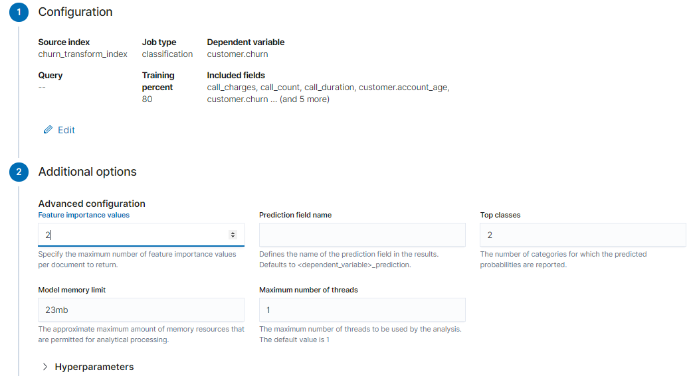

- Keep all other parameters to default and click on continue
- Give the job a unique ID
- Add a nice description
- Defines the name of the field in which to store the results of the analysis. Defaults to ml.
- Specify where our predictions will be written
- Click on continue, then create

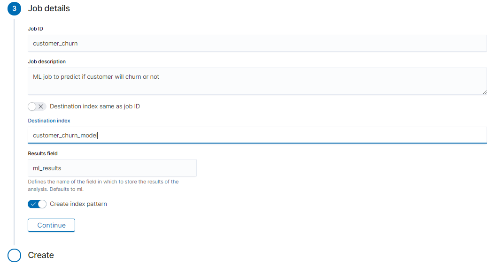

- Wait for the job to finish

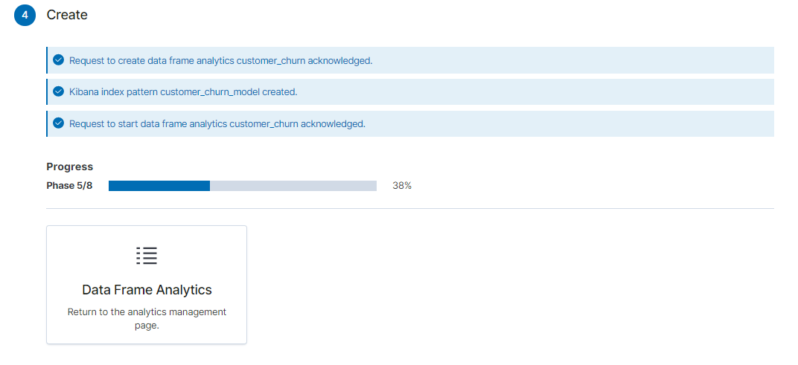

- Make sure the index `customer_churn_model` where the model will be stored has been created

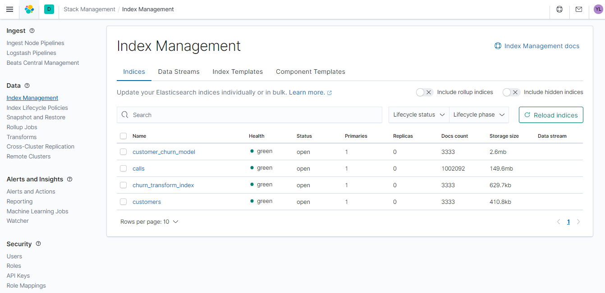

Once analytics job executed you should have data that looks like this :

In the customers `customer_churn_model` :

```json
{
  "call_count": 394,
  "ml__id_copy": "Mg-6H54tQSW52RwzsWW1wI0AAAAAAAAA",
  "phone_number": "2253709563",
  "call_charges": 69.33000000000007,
  "call_duration": 653.6000000000007,
  "customer": {
    "voice_mail_plan": "yes",
    "number_vmail_messages": 26,
    "churn": 0,
    "account_age": 32,
    "phone_number": "2253709563",
    "state": "AB",
    "international_plan": "no",
    "customer_service_calls": 1
  },
  "ml_results": {
    "customer.churn_prediction": 0,
    "top_classes": [
      {
        "class_probability": 0.9555746006568655,
        "class_score": 0.07567234887325856,
        "class_name": 0
      },
      {
        "class_probability": 0.04442539934313445,
        "class_score": 0.04442539934313445,
        "class_name": 1
      }
    ],
    "prediction_score": 0.07567234887325856,
    "prediction_probability": 0.9555746006568655,
    "feature_importance": [
      {
        "feature_name": "customer.international_plan",
        "importance": -0.23469168614313005
      },
      {
        "feature_name": "customer.voice_mail_plan",
        "importance": -0.21462005585238877
      }
    ],
    "is_training": true
  }
}
```

This analytics job will determine the following:

- The best encodings for each feature
- Which features give the best information or which should be ignored
- The optimal hyperparameters with which to build the best model

Once it has finished running, we can see the model error rates given its testing and training data.

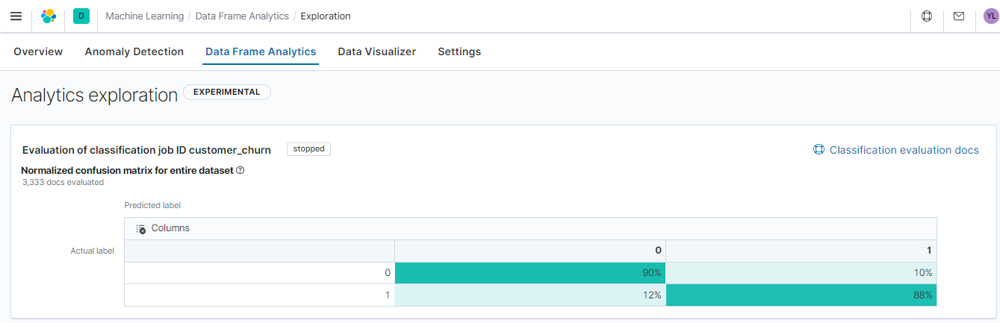

Pretty good accuracy ! If you are following along, your numbers might differ slightly. When the model is trained, it uses a random subset of the data.

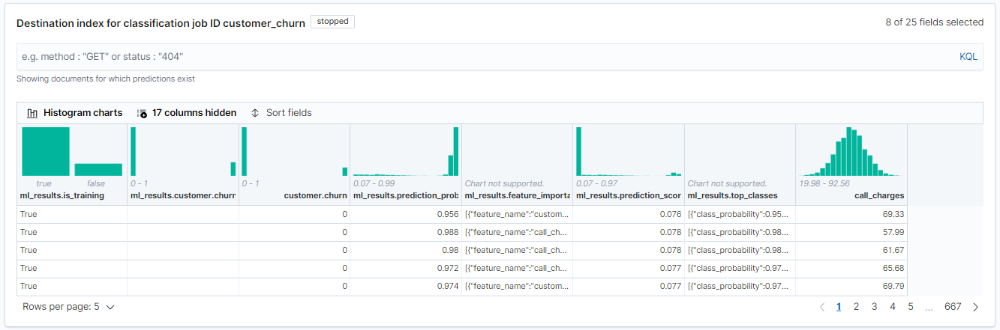

We now have a model that we can use in an ingest pipeline.

# Using the model

Since we know which data frame analytics job created this model, we can see its ID and various settings with this API call:

```json
GET _ml/inference/customer_churn*?human=true

```

The result should looks like this, with the model id to be used later `customer_churn-1596114719951`

```json
{
  "count" : 1,
  "trained_model_configs" : [
    {
      "model_id" : "customer_churn-1596114719951",
      "created_by" : "_xpack",
      "version" : "8.0.0",
      "create_time_string" : "2020-07-30T13:11:59.951Z",
      "create_time" : 1596114719951,
      "estimated_heap_memory_usage" : "46.4kb",
      "estimated_heap_memory_usage_bytes" : 47544,
      "estimated_operations" : 142,
      "license_level" : "platinum",
      "description" : "ML job to predict if customer will churn or not",
      "tags" : [
        "customer_churn"
      ],
      "metadata" : {
        "analytics_config" : {
          "max_num_threads" : 1,
          "model_memory_limit" : "23mb",
          "create_time" : 1596114678853,
          "allow_lazy_start" : false,
          "description" : "ML job to predict if customer will churn or not",
          "analyzed_fields" : {
            "excludes" : [ ],
            "includes" : [
              "call_charges",
              "call_count",
              "call_duration",
              "customer.account_age",
              "customer.churn",
              "customer.customer_service_calls",
              "customer.international_plan",
              "customer.number_vmail_messages",
              "customer.state",
              "customer.voice_mail_plan"
            ]
          },
          "id" : "customer_churn",
          "source" : {
            "query" : {
              "match_all" : { }
            },
            "index" : [
              "churn_transform_index"
            ]
          },
          "dest" : {
            "index" : "customer_churn_model",
            "results_field" : "ml_results"
          },
          "analysis" : {
            "classification" : {
              "randomize_seed" : 4593507844979913957,
              "dependent_variable" : "customer.churn",
              "num_top_classes" : 2,
              "training_percent" : 80.0,
              "class_assignment_objective" : "maximize_minimum_recall",
              "num_top_feature_importance_values" : 2,
              "prediction_field_name" : "customer.churn_prediction"
            }
          },
          "version" : "8.0.0"
        }
      },
      "input" : {
        "field_names" : [
          "call_charges",
          "call_count",
          "call_duration",
          "customer.account_age",
          "customer.customer_service_calls",
          "customer.international_plan",
          "customer.number_vmail_messages",
          "customer.state",
          "customer.voice_mail_plan"
        ]
      },
      "inference_config" : {
        "classification" : {
          "num_top_classes" : 2,
          "top_classes_results_field" : "top_classes",
          "results_field" : "customer.churn_prediction",
          "num_top_feature_importance_values" : 2,
          "prediction_field_type" : "number"
        }
      }
    }
  ]
}
```

With the model ID in hand we can now make predictions. We built the original feature set through transforms. We will do the same for all data that we send through the inference processor. 

````json
# Enrichment + prediction pipeline
# NOTE: model_id will be different for your data
PUT _ingest/pipeline/customer_churn_enrich_and_predict
{
  "description": "enriches the data with the customer info if known and makes a churn prediction",
  "processors": [
    {
      "enrich": {
        "policy_name": "customer_metadata",
        "field": "phone_number",
        "target_field": "customer",
        "max_matches": 1,
        "tag": "customer_data_enrichment"
      }
    },
    {
      "inference": {
        "model_id": "customer_churn-1596114719951",
        "inference_config": {
          "classification": {}
        },
        "field_map": {},
        "tag": "chrun_prediction"
      }
    }
  ]
}
````
Time to put it all in a continuous transform.

````json

PUT _transform/continuous-customer-churn-prediction
{
  "sync": {
    "time": {
      "field": "@timestamp",
      "delay": "10m"
    }
  },
  "source": {
    "index": [
      "calls"
    ]
  },
  "dest": {
    "index": "churn_predictions",
    "pipeline": "customer_churn_enrich_and_predict"
  },
  "pivot": {
    "group_by": {
      "phone_number": {
        "terms": {
          "field": "phone_number"
        }
      }
    },
    "aggregations": {
      "call_charges": {
        "sum": {
          "field": "call_charges"
        }
      },
      "call_duration": {
        "sum": {
          "field": "call_duration"
        }
      },
      "call_count": {
        "value_count": {
          "field": "dialled_number"
        }
      }
    }
  }
}
````

As the transform sees new data, it creates our feature set and infers against the model. The prediction along with the enriched data is indexed into churn_predictions. This all occurs continuously. As new customer call data comes in, the transform updates our churn predictions. The predictions are data in an index. This means we can operationalize via alerting, build visualizations with Lens, or build a custom dashboard. 

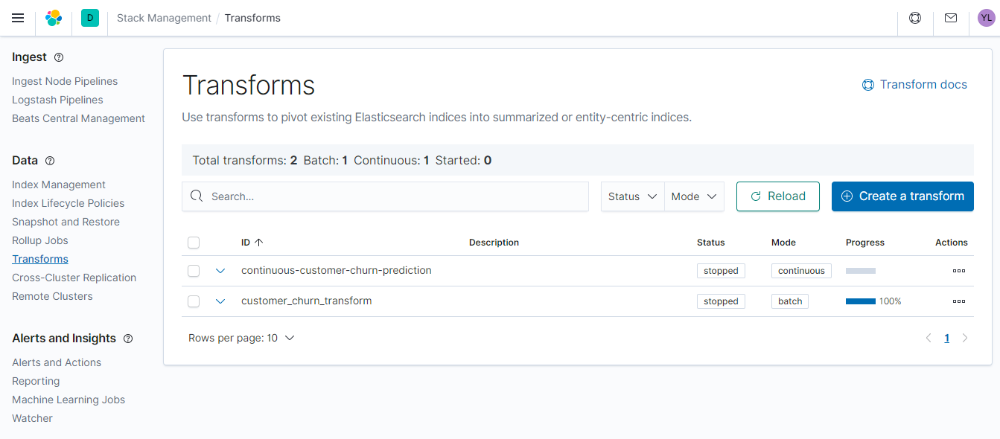
